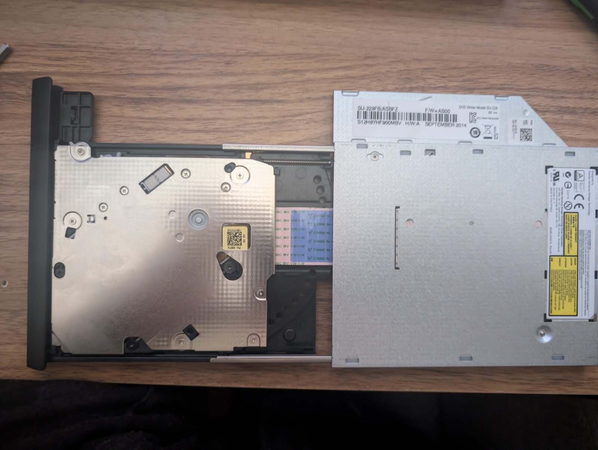
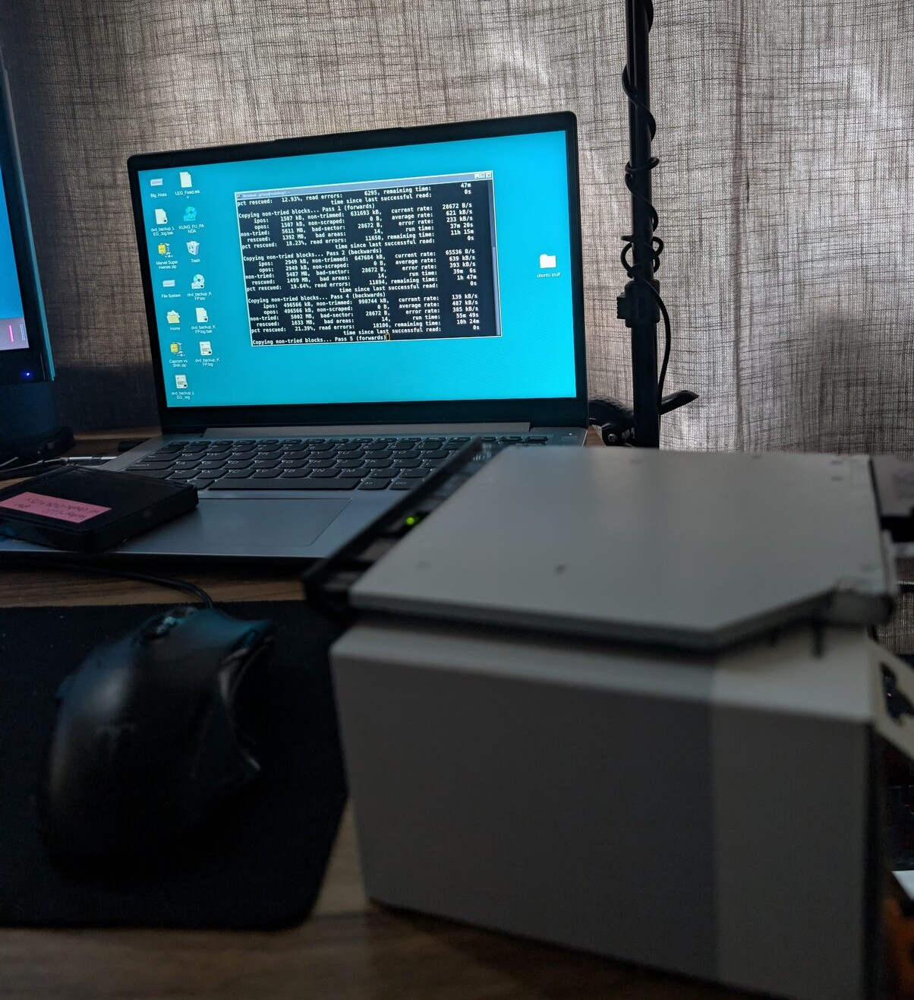
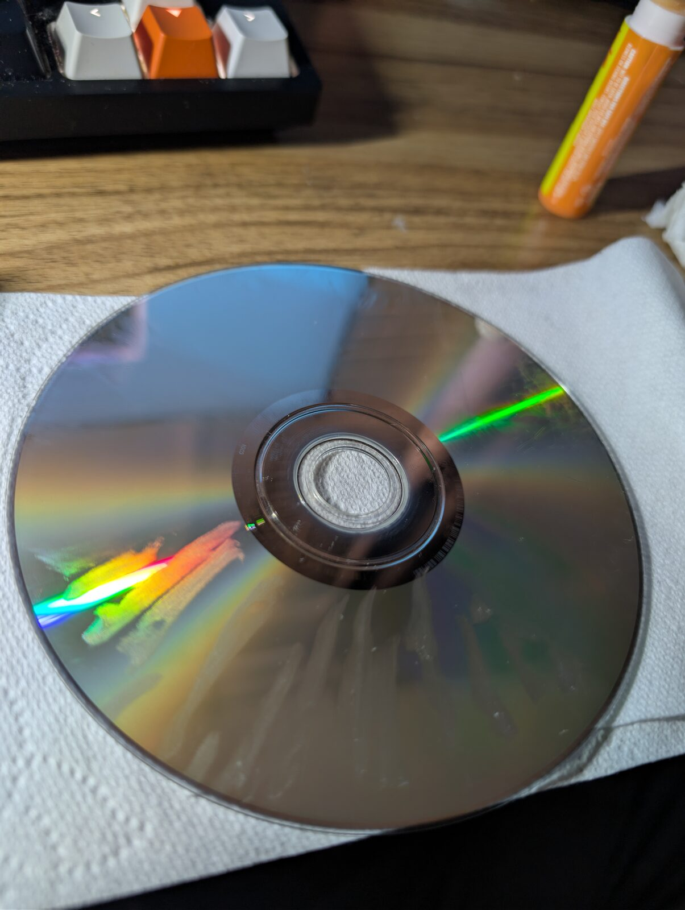
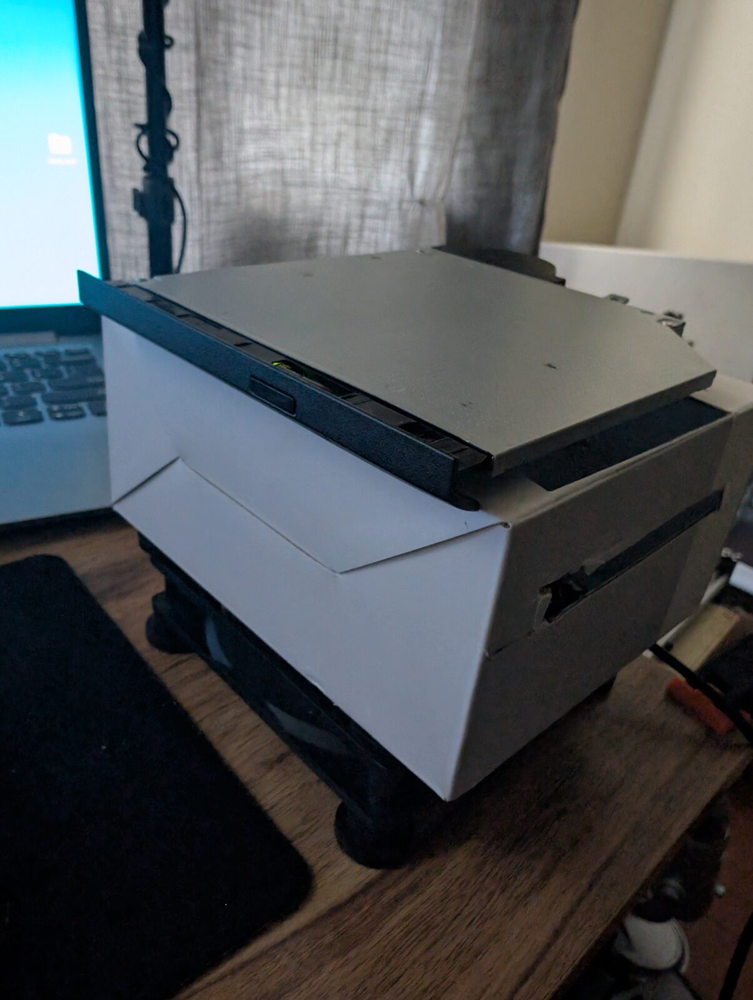
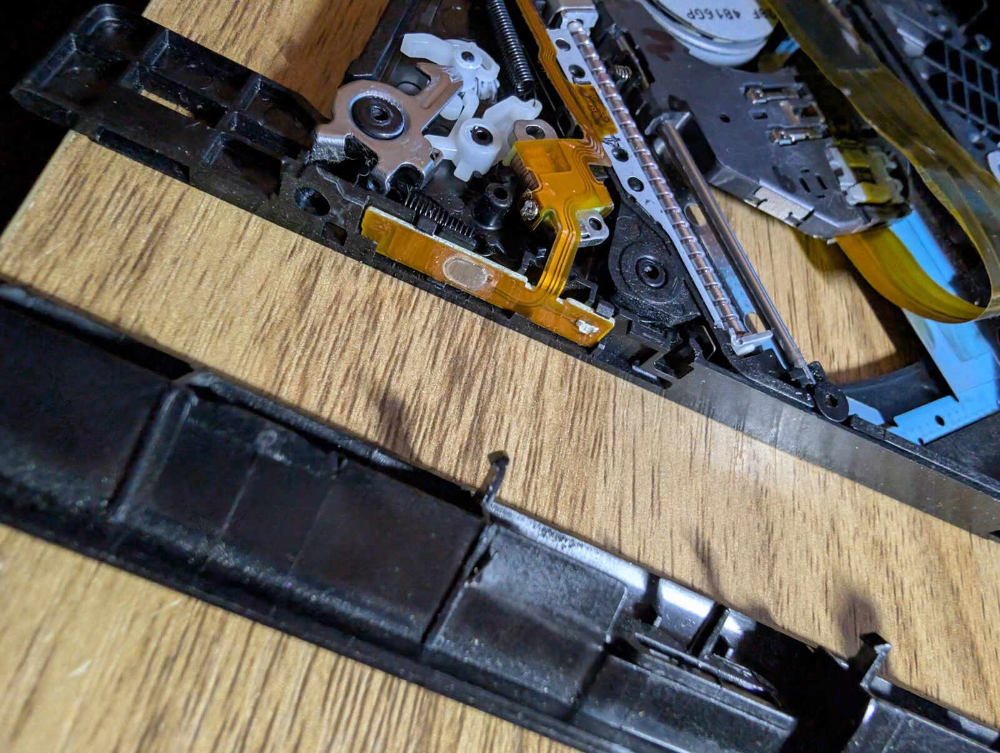
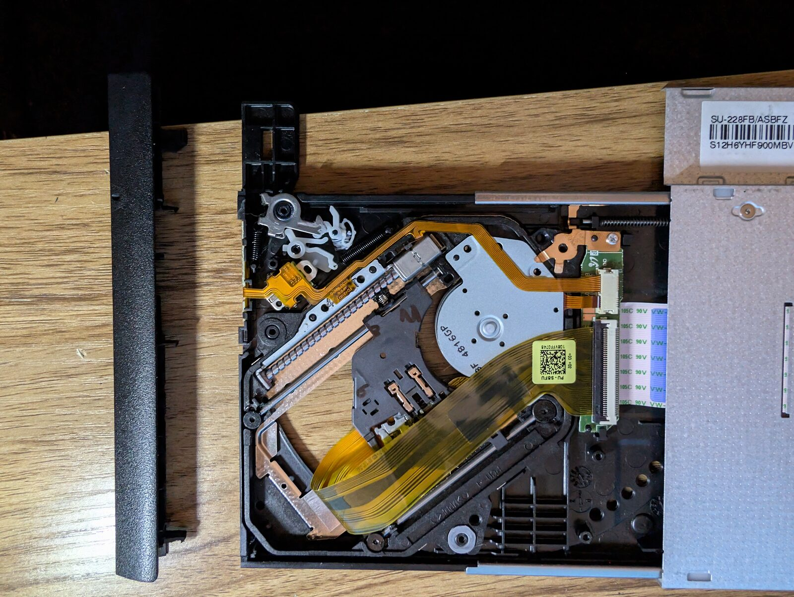

# 🖥️ Archiver A-82 Media Server *(In Progress)*

---

[Back to Portfolio Homepage](../index.md)

---

### Project Description

Starting from a baseline fascination with recovering and archiving physical media, progressing into creating a stable local media server. Motivated by a growing desire to preserve media outside of corporate ownership, and ultimately building towards a stable, secure, Wide Area Network (WAN) based server.

---

### Details

* **Devices:** ASUS SU-228 DVD Drive + Lenovo ThinkCentre M910q i5-6500t
* **Scope:** Physical media recovery > Centralized server architecture.
* **Objective:** Establish a functional WAN Home Media Center
* **Tools Used:** MakeMKV, ddrecuse, ffmpeg, SATA-to-USB bridge, Ubuntu-server, Plex, Kodi, CLI networking tools.

### Project Logs

---

### Volume_001_Inkling

<b></b>2026-05-13: DVD Ripping
b>

### Project?_

I don't have a definite plan yet as to what I'm doing for this project or even if this IS a project. More of a feeling fueled by curiosity.

From the ARCIO project, I've had some various bits of hardware laying around from the ASUS laptop, one of which is a DVD drive. It's a tad flimsy but it does work. I got a SATA to USB 3.0 cable for it
and have built up a folder of a few movies. Just some "old" DVD's I have in a box that I haven't opened since I was much younger. I downloaded MAKEmkv and just got to work ripping DVD's on my Lenovo laptop. Stacking up ~15 beloved movies from my childhood. They have a bit of grain, but man, this process awoken something in me. 

### Nostalgic Nirvana_

Though the process was a bit different from when I was younger, the feeling was very much the same. Popping the first DVD into the tray, spinning it up in MAKEmkv and watching the progress bar fill for about twenty minuets. Opening the raw .mkv file and watching a slightly grainy IRON MAN stumble around, was such a joy. That was the first DVD I ripped as it was one I had watched over and over as a kid. This felt special, not just the movie but the process as a whole, It was tactile and required patience. I haven't watched all 15 of the DVD's I've ripped, but I want to do more.

### Archiving_

Outside of very much enjoying the process of "Archiving" I've been making a slow but meaningful run at moving away from streaming services. I had wanted Ghost to be able to store and play music, similar to a google home or Alexa. I ultimately killed that idea... I just need her to stay a dedicated Documentarian for now. But I have moved away from Spottily entirely and now store music locally and have backups. I use metro on my phone and Tablet for my music, its very enjoyable and its neat to purchase and album and listen to it independently without seeing how the artists numbers.

I plan to do something similar with movies and shows, I think it would be cool and efficient if all my favorite media was in one place and no streaming service could control when or what I want to watch. It would be MY streaming service. I don't entirely know how yet but I have a few ideas and am overall just enjoying the process.

  

<b></b>2026-05-17: DVD Recovery
b>

The past few days I've embarked on a journey, a rough journey as it has largely ended in failure, but I've learned a ton and had fun.	

	
### A spark of fire_
	
Digging through the movies in the dusty box the other night I had come across 2 disks in particular that I couldn't get MAKEmkv to register, I was bummed, but its a familiar feeling. As a kid if a DVD didn't work I'd put it back in it's plastic case, morn it, then put it back on the shelf and find another DVD that did worked. I may still be a primitive ape, But now... I've entered the stone age.

	
### Monkey see, Monkey do, Monkey dd res-cue_

I downloaded ddrescue, which is a data recovery tool that functions entirely through the terminal, its pretty neat. It's automated, you can set flags to hone in what exactly you need it do and it will get to work recovering what it can, skipping and or retrying bad sectors and even reverse passes. ddrescue even keeps track of the progress so if it stops or the DVD is removed, the progress remains. It's very cool.

### Notes From My ddrescue cheat-sheet_

* **Start recovery on disc:**

		sudo ddrescue -n -b 2048 /dev/sr0 /home/username/Desktop/dvd_backup_MOVIE.iso /home/username/Desktop/dvd_backup_MOVIE.log

* **Skip ahead 100MB if stuck:*

		sudo ddrescue -n -b 2048 -i 1140MiB /dev/sr0 /home/grizzy/Desktop/dvd_backup_MOVIE.iso /home/grizzy/Desktop/dvd_backup_MOVIE.log

* **Retry after finished:**

		sudo ddrescue -d -r 3 -b 2048 /dev/sr0 /home/grizzy/Desktop/dvd_backup_MOVIE.iso /home/grizzy/Desktop/dvd_backup_MOVIE.log

* **Reverse flag if forward run doesn't make progress:**

		sudo ddrescue -R -b 2048 /dev/sr0 /home/grizzy/Desktop/dvd_backup_KFP.iso /home/grizzy/Desktop/dvd_backup_MOVIE.log

## Flag cheat sheet_

​-b 2048 (Sector Size): Non-negotiable for optical media (DVDs/CDs). Forces the software to match the physical sector size of the disc, preventing bad math under the hood and keeping the hardware aligned.

​-R (Reverse Pass - The Secret Weapon): Forces the laser to read the disc completely backward (from the outside edge inward). Essential for multi-layer DVDs where Layer 1 reads in reverse, allowing you to bypass a front-end crater and claw back data from the rear flank.

​-p (Pre-trim): Tells the laser to focus strictly on the borders where good data meets bad data, shaving the edges of a scratch sector-by-sector rather than blindly diving into the center of the crater.

​-r 3 (Retries): Tells the software how many times to aggressively re-try reading a bad sector during the scraping phase before giving up. (Best used on tough discs that aren't prone to hard-freezing).

​-E 100Ki (Max Error Rate): Acts as a safety valve. If the drive hits a massive dead zone and starts logging errors faster than 100 KB per second, ddrescue will forcefully skip the rest of that rough block to keep moving, preventing the drive firmware from locking up.

​--timeout=10s (Total Stall Timeout): Tells the entire program to exit if it goes 10 seconds without finding any new data. (Useful for automated scripts, but will stop the run if you start right on top of a massive scratch).

## ddrecue output x ffmpeg_

If all goes well by the end of this process you'll have a 100% recovered .iso saved to your computer. However... I was unsuccessful in seeing a fully recovered 100% clean .iso, but I got close.

See Log [2026-05-17_Kung_Restore_Panda] for details about the 4 recovered discs

Once I had a ~100% recovered .iso from ddrecure, I verified what i'd gotten in VLC media player. Checking for significant frame drops, artifacts and audio clarity:

* **Check in VLC:**

		vlc /path/to/MOVIE.iso

Then opening up ffmpeg, which is terminal based video trans-coder at heart. It's pretty powerful and can be used in many different ways but for my purposes, I used it to repackage or "remux" the raw MPEG2 files within the recovered .iso into an .mkv container.

* **Remuxing an .iso into an .mkv:**

		ffmpeg -err_detect ignore_err -i "dvd_backup_MOVIE.iso" -map 0 -c copy "MOVIE_movie.mkv"

Because remuxing takes all of the MPEG2 files on the DVD.iso and joins them into an single .mkv... I also used ffmpeg to trim the .mkv as to get get the movie by itself. Otherwise I'd have essentially a video of a DVD menu, then the actual movie, then credits and then various trailers and stuff tacked on at the end.

* **Trim with:**

		ffmpeg -ss 00:00:00 -to 02:00:00 -i MOVIE_movie.mkv -c copy MOVIE_movie.mkv

And now I'd have a recovered copy of an "unreadable" disk to enjoy. "easy peezy"

  
  

<b></b>2026-05-17: Kung Restore Panda
b>

A brief overview of my recovery attempts...

### League of Extraordinary Gentlemen_

A movie I have not seen in a very long time, but I have fond memories of watching it as a wee man. This was my most successful Recovery attempt. 99.79% recovered. ddrecuse clocked 24 hours 07 minuets and 30 seconds of total runtime... Unfortunately as of right now the .mkv file of LEG has no audio... I'm guessing that's due to something I messed up during the remuxing phase as when I checked the initial .iso in vlc it did have audio. So I believe it's still fixable. Admittedly it's not super clean, fairly rough on the overall quality, but I'm pretty happy with it.

### Kung Fu Panda (Fullscreen)_

A movie I very much enjoyed and one that I had re-watched last year for the first time since I was a kid. It was still great, It's truly a masterpiece.

This was a weekend event... I ran this KFP disk through ddrescue on Friday before I left for work and it hit a snag sometime in the day, getting stuck around 20%... thus begun me spending the entirely of my weekend battling this disk... in the end... I lost... the disk failed to fully be recovered. I only managed to recover 47.6% ...Which is rough because most of my time spend was after ddrescue failed at around 38% ...so most most of my time was fighting for that last 9%. ddrescue's up-time for this disk was 46 hours, 03 minuets and 49 seconds. That's roughly 1.03% per hour... 

Keep in mind this is a Full screen DVD copy of Kung Fu Panda... not a sleek blueray nor even an immersive widescreen experience.

I regret nothing.

<b></b>2026-05-19: Archiver A-82
b>

### Unstable Stack_

My current physical setup with the DVD drive is a tad unstable. But it has gotten me this far... archiving around 20 movies and surviving 70 hours of ddrescue up-time. 

Up until The Battle of Kung Fu Panda, I've had the drive sitting on the desk, but when I started clocking continuous hours of disk recovery time, I noticed the bottom of the drive was getting
extremely hot. So I "built" a simple little rig, Setting the drive on a small cardboard box with a 5V fan underneath blowing cool air through holes I cut in the bottom & top of the box. The cool air blowing directly onto the bottom of the drive has kept things cool and seems to have sped up my DVD rips. Nothings is joined, just stacked, it's functional and has solved a problem... however, if I accidentally were to topple this stack while a DVD is spinning at 5400Rpm... I may die, But even more heartbreaking, It would destroy the disk and the drive.
 

### Flaws & Fixes_

* **Eject button**
One of the most annoying things about this drive is the eject button, its essentially flush with the face plate of the drive's tray. Its hard to press and I often cant press it in deep enough to make contact with the membrane switch. A simple fix could be tacking a bit of extra plastic onto the existing, flush button.

* **Indicator light**
The light is behind the face plate, but the face plate has zero transparency or bulb to let the light through... this drive was originally in the ASUS laptop, but the laptop has no bulb of any kind to allow the light to be seen. Strange. Now that the drive is out of the laptop, the light CAN be seen from above, however it is tucked down into the plastic and difficult to see. I cannot always hear if the DVD's are spinning up as I have the fan going to reduce the drives heat as well am typically working on something else with headphones on while the drive works, it would be nice to have the light, this would give me the ability to check on the drive at a glance. A simple fix could be channeling that light with a piece of leftover plexiglass from the Surface Book Project to act as a fiber optic tube of sorts.

* **Face plate**
The face plate has an odd shape, meant to perfectly aligning with the beveled edges of a laptop, now that its free from its original enclosure, changing this may aid in getting it settled into a new chassis as well as fix the above two issues. Though changing this has stumped me a bit... I could make a new face plate out of wood, though it would be small and very difficult to work with... but the more pressing issue is attaching it. The original face plate connects in a very specific and perceive way. It's too small of an area for any sort of screws or fasteners. Glue sounded like an easy fix, but wouldn't be very durable, not to mention there isn't a ton of places that I could get a meaningful amount of glue on. the edge of the tray where the face plate attaches is "porous" and just behind that is the laser and delicate circuitry... so I'm stumped for now.

### Practical_

* **Cooling**
This drive will heat up, and fast. Having it suspended along with cool air being blown directly on the bottom seems to completely fix this, it hasn't even gotten warm since I've adjusted to this setup. So withing a chassis, which will be made of wood, I'll need to do the same. 

* **Stability**
Given that the drive is currently resting on a stack, when the tray is ejected, it wants to tip and topple over. Obviously once mounted, this will be solved. Mounting a DVD drive is a tad tricky... The drive itself has a single native hole that I can pass a small screw though, its largely dependent on a bracket that is designed to sort of clamp the drive down against standoffs that were in the tub of the laptop its designed for... may have to bore out some holes for better screws and shim something up to get things even.

* **Pinching**
This is the biggest culprit when clamping a DVD drive, if the drive is pinched it will fail, scrape the disk and maybe just cease to exist. The bracket for the drive is awkward, but is designed to evenly hug the drive as to avoid this... hence why I'd like to use it... not sure how yet.

### Design Choices

* **Window**
Foolishness, but I think it would be cool. Cutting a small window into the metal of the drive so I can watch the disk spin up. As long as I don't compromise the structure of the drive, or have too much light conflicting with the laser, this should be fine. Unnecessary, but neat.

### Archiver 82_

There are complications with getting this DVD drive locked into a wooden chassis along with the 5V fan, I'm just going to keep mulling it over and see what I can come up with. I have decided a name for the drive: Archiver A-82 a reference to Archive 81, which is ironically a show that can't really be archived as no physical disks were printed... And to pay a little homage to my first project,  the donor of the drive, the ASUS laptop aka A.R.C.I.O. Also, it sounds neat.

  
  
  

---

### Volume_002_Expansion

<b></b>2026-07-13: Spite
b>

### Days Gone By_

Two months have passed since opening the drive to investigate it's internals and develop a plan for an upgrade...

I was racking my bring trying to think of a way to do this while also guaranteeing I don't destroy the one DVD drive I have, as I very much wanted to continue archiving. Problem is, the drive has been dismantled and strung out on my desk this whole time, so no ripping could be done. Eventually I side stepped it entirely, not thinking about the new plans or archiving as a whole. The other day I gave the drive a look for the first time in a few weeks and... it bummed me out, still uncertain of what I wanted to do and the fact that I've put this new and exciting interest of mine on hold. I got a bit overwhelmed and again, didn't want to think about it.

### Moodboarding_

In hopes of reigniting my passion for the project, I dug around on Ebay, DeepDiscount, Amazon, Thrift books, etc. Looking for a few movies I'd like to archive... I found some and... still nothing... Obviously I knew that this wouldn't solve the blockage, but was hopeful It would give me some kind of incentive. 

### Spite Build_

This past Friday (10th), I got home and needed to just coast for a bit, I had a long week and a rough day. Still having a small stack of some favorite DVD's I had purchased, all I wanted to do was pop one in and relax for a bit. My dell xps 8910 has a DVD drive, but it doesn't work, I knew that already, but tried anyway and then just sat there, grumpy, tired and bummed. 

Then, with absolutely no thoughts in my head, I got up and gathered a few items closest to me, and did a pure "spite build" getting the DVD drive that had been laying in pieces into a chassis of sorts. Given it had been apart for so long, I had lost some crucial screws... that only fueled the build. Using Cardboard, electrical tape, super glue, plexiglass and drawstring... after 20 minuets, I had a functional drive again. I ripped EVIL DEAD RISE and a few others, ultimately having a pretty relaxing night. The drive doesn't wobbled, The tray is stable when pulled out and I used the plexiglass to channel the indicator light, its much more visible now. The drive is in the cardboard box that my MIDI controller box came in, tied to the 5V fan with a draw string. It's not perfect and doesn't check every box in my original build plan... but it 100% works. 
Spite is a a powerful tool, I suppose.

### My Flaw_

Passion nor Incentives were the issue, my plan was. I got to thinking... This was a DVD drive from a 2014 ASUS laptop... a cheap, flimsy drive, It can't read Bluerays, nor 4k, just good old DVDs. 

I over complicated this so much it almost killed this project before I even knew it was a project. It was good to have a 2 month stalemate... in a sense, it allowed me to focus on my IT studies, but essentially I spent 2 months racking my brain for something that could've been done in 20 minuets. It took me being overwhelmed and annoyed at 6pm after a long week and minimal sleep, but the fact remains.

I am very likely to reshape this drive in the future, maybe when I upgrade to a Bluray setup, I'll mess with this old drive and have it as a neat little monument of a chassis to my earlier days of ripping... time will tell, I'm not going to overthink it.

<b></b>2026-07-15: M910Q
b>

### Mojo reloaded_

That little ASUS DVD drive mounted in it's cardboard chassis is going strong! At this point I've nearly doubled my archive library from that first night, sitting around 25 films with more in the plans. I'm very glad I simplified things and am back to doing what I actually want to do, ripping DVDs. And now, I'm ready to really establish this lose idea into an actual living project... I want to create a genuine media server. There are bigger future plans, but I'll hold off on those for now.

### Migration_

All that being said, I believe I've made a critical decision. As of now, my movie archive is simply on a folder within my Lenovo ideapad'ss 500gb SSD appropriately named Big_Hoss. My plans were to migrate to and covert my Dell XPS 8910 into a server. My dell has been running Ubuntu Server for a few months now and I've installed a xfce GUI atop it, it's a daily driver that I use for Video work and Music Production... given that... I'd prefer it was not a dedicated sever and storage facility for movies and music. I probably will keep it with Ubuntu server as it's ultra light.

The issue is, I don't have another device that could supply the needed space and be robust enough to host a server. The dell XPS 8910 is an i7 tower, its robust but operates more like a race car, if I have it running a media server 24/7, it will surely cut down on it's lifespan.

### Hardware upgrade_

Enter M910Q, a mini Lenovo ThinkCenter. These are designed specifically for my purposes, it has an Intel Quick Sync Video hardware core build directly into the processor. My specific model is the i5-6500T (Gen-6). 8Gb of RAM and a native 256GB SSD. This is a petite tank designed to run 24/7 and handle trans-coding video like a dream... the native 256GB SSD is fine for now but luckily it has a SATA slot so I can expand. 

It's a Lenovo so I have faith. My lenovo laptop that I got from a business sale, is a pretty cheap model but has been my most reliable tool for the past few years. Lovely, Loyal, Lenovo.

The ThinkCenter is a refurbished device, I bought online for 116.99$, basically stole the thing. Given the restored nature and price point, there was a chance of missing components and it potentially not working all together, but baby steps.

It arrived today accompanied by a cheap mouse and keyboard, and it does turn on... but.. while I have collected a grotesque amount of HDMI cables of there years... I don't have a single Display port cable... I did open it up and everything internally looks okay from what I can tell but without a Display port... I cannot verify anything at this time other than it looks great and the light comes on when I hit the power button. 

Just need a Display Port, then it's go time.

<b></b>2026-07-17_20: Link & Locker
b>

### July 17th - Display-Port

The display port arrived today and I was able to confirm that the Think Center dose in fact work. I immediately replaced the preinstalled Windows 11 with Ubuntu Server then ran into the first issue...

### No WiFi card_

This is not something I was expecting, though through some light research I found that with these business class mini PC's Like the M910Q, Wireless was an optinal configure to order feature when buying from factory. I suppose this makes sense, it's both more secure and cost effective for a company to have it running wired.

Luckily from working on Ghost, I have an Ethernet cable and dongle for my Lenovo laptop. Easy fix, I just ran an Ethernet cable from the Think Center to my RJ45 to USB dongle for my Lenovo laptop, configured a static IP and boom, we have internet on the Think Center. This network bridge has been a pretty solid fix, though I will definitely need a more independent solution for getting my Think Center on the net.

### July 19th - WiFi Adaptor_

Ah finally... it was time to take this puppy off-roading. This was actually both a worrisome and exciting thing. I was worried because as soon as I went looking for a WiFi adapter I read alot of chatter like:

"Get the right one or linux will break your arm!" 
"Don't download the wrong driver or you're screwed!" 
"Plug in the drive FIRST or you'll die!" 
"Download the driver first or you'll die IMMEDIATELY and very painfully!"

I am paraphrasing a bit here but even so, it's something I actually don't come across too often but there typically is some kind of Life or Death vibe to certain things when Linux is involved... it could be genuine, a type of gate keeping or maybe just an extremely cautious loud minority... I couldn't tell you. I will say that some things will Linux are needlessly complex until you understand the WHY then it sorta clicks... but I see Linux as a sort of super powered baby, it is truly amazing, the doors these distros can open for you... but at the same time, piss the baby off and you'll suffer.

### Yes, WiFi card_

It was actually pretty simple. Once I got my adapter which was a BrosTrend AX900 Mini USB I "rolled the dice" and found out which driver would be compatible and installed it. Then adjusted my /etc/netplan file by adding a WiFi section. Then pinged Google at 8.8.8.8, 6 packets transmitted, 6 received, 0 packet loss and boom... wireless connection to the internet established.

	/etc/netplan

	network:
	  ethernets:
	    enp0s31f6:
	      match:
		macaddress: 6c:4b:90:28:70:24
	      set-name: enp0s31f6
	      addresses:
		- 192.168.10.2/24
	      routes:
		- to: default
		  via: 192.168.10.1
	      nameservers:
		addresses: [8.8.8.8, 8.8.8.4]
	  version: 2

	  wifis:
	    wlx68157906781c:
	      dhcp4: true
	      optional: true
	      access-points:
		"WiFi Network":
		  password: ******* 

### July 20th - SSD_	

The day I got the Think Center, I opened it up. It only has a single screw, then the top of of the case slides off, which is pretty neat. I had checked to make sure the hardware appeared in good condition and was also verifying that it had a SATA slot for expanding the storage. It dose and even has a nice cage to keep the drive secure. Obviously it was unoccupied and while the M910Q does have a native 256GB drive, I knew id need more space. 

I have 3 external drives, all HDD's and while they work... they aren't exactly the best in terms of speed or durability... So I wanted to get a nice internal SSD. I was looking at Samsung SSD's as I have a Samsung Bar plus USB drive and I adore that thing. The Samsung Bar is super fast could probably stop a bullet. HOWEVER... Samsung SSD's are craaaazyy in terms of pricing... so maybe down the line if I sell a kidney I'll have the cash for the high end stuff. 

For now I've gone with the Crucial BX500 SATA SSD 2TB drive, it's nothing flashy, but for the price it's a solid and reliable option for getting things in motion. It did feel a bit cheap when I got it out of the package, but it is pretty snappy.

Can't judge a drive by it's shell, I'd say.

<b></b>2026-07-21_08-05: Kodi (MCS PART-1)
b>

### Media Center Software_

The Time has come, I can rebuild HIM, I HAVE THE TECHNOLOGY, I have the capability to make the world's first BIONIC MAN! ... However, I'm not going to do that as I've spent all my money on DVD's, so... I'm going to settle for setting up my first MCS. 

Now that I have the dedicated hardware, plenty of storage and a healthy 30 and growing library of movies, it's time to organize them into a nice platform. My long term goal is to have my own private "streaming service" that myself and my sister, whom is on the other side of the country can enjoy anytime, anywhere... Having all of our favorites and no bloat, subscription fees or licensing agreements to worry about. Though I don't exactly know how to do that securely or properly yet, so let's start small, lets start local.

I don't know much about how Media Center Software works, But I understand scraping, which is a large part of it. The films I've archived are all .mkv files, which are... technically "dumb", meaning they are simply a box holding video, audio and necessary subtitles. Scraping is an automated service that scans the internet and gathers all the artwork, proper titles and descriptions, organizing everything into a clean UI like seen on a proper streaming service. Given that, I think this will be a pretty streamlined process and may be the easier part of building a local media server. The hard part comes when I go from LAN to WAN.

For my first go at navigating a MCS, I've chosen Kodi, this will be LAN locked as Kodi doesn't have the capabilities to act as a genuine server. For getting my feet wet, it should do the job just fine while I learn and build out my library.

### 2026-08-05 The Kodi Experience_

Over the past few weeks I've used Kodi exclusively. I'll admit, I was intimidated at first but quickly this software become super familiar. Kodi is very intuitive to use, however, it's also fairly complex in how much freedom it gives you. Many different skins and settings just at your fingertips. I like Kodi for the most part, but it has some pretty catastrophic drawbacks...

* **Old man Kodi**

A pretty cool thing about Kodi is that its one of the OG's of Media center software. Originally made as an media center specifically for the original 2003 Xbox. Back Then it was called the Xbox Media Center (XBMC). Kodi has been around a while, officially taking up the name Kodi in 2014, a play on the word "code".

The XBMC era of Kodi is still apparent in a sense, at least the fossils are... its clear Kodi was built with a controller in mind for navigation, not a computer mouse. This was a drawback initially for me, but I picked up the keyboard shortcuts and navigating with the arrow keys within the first few hours of using it.

The real issue with Kodi is deeper, within it's DNA. Kodi's scrapers have been rewritten and up-kept over the years, moving from from XML to Python plug ins... The underlying architecture remains. This is something I've experience first hand... many times while using Kodi. Those legacy constraints from the XBMC era make Kodi very delicate and unstable. Meaning crashes are frequent, most notably when scraping for new media in your source folders... and these crashes are catastrophic, Kodi will freeze up, crash and completely reset back to factory... this is brutal. All the organization, customizing and setting fine tuned, gone. I had to deal with this 6 times during my time with Kodi and It's ultimately why I'll be moving away from Kodi outside of other limitations like a lack of WAN capabilities.
	

* **Accessibility**

An admirable quality is all the little tweaks you can do on the fly, right inside the player. 
Adjusting video scaling method, swap from Lanczos, Spline, Bilinear while playback is active. Color settings and adjustments can be made, like Brightness and contrast as well as custom subtitling and on the fly audio swapping. Just as a brief overview of course and not to say I or anyone else needs to adjust all of these all the time, but it's nice that the ability is there, yet not in your face. The neatest thing is that every different video can be saved with these different setting independently, or you can enable a default save for all media. All that, just in the player menu.

I messed around with these player settings alot at first, as the initial few days of using Kodi I was experiencing Screen Tearing. Going deeper into the master setting and trying different toggles like "Sync playback to display" but nothing worked... eventually the screen tearing fixed itself days later, I'm still not sure how... maybe it was a driver issue that got updated or found it's rhythm in the background, no clue. I didn't have any issues with screen tearing after that.

* **Interface**

Its very clean and easy to use, the setting are abundant with a lot of customization and fine tuning capability. The overall Kodi UI oddly reminds me of an old school Netflix, which I liked, a small dose of nostalgia.

Minor drawback on the UI for settings... they are layered, within settings there are 8 categories: Player, Media, PVR & Live TV, Services, Games, Interface, Profiles and System. within each category are layers of setting access types: Basic, Standard, Advanced and Expert. This is organized, sure, but also a bit obnoxious... I think the different settings categories are fine, but the Levels of settings from basic to Expert is odd and a bit nonsensical.

* **UPnP_Universal Plug and Play**

This was my favorite feature of Kodi, I had actually never even accidentally heard of this in my life. It's very neat and extremely easy to set up. It's simply a LAN tool that allows devices to automatically find one another and communicate. Toggling on UPnP within Kodi and on another device, In my case, my tablet running VLC. I can open the app, and my entire Kodi library appears in my Local Network section. Zero buffer times, it plays media instantly. 

The only drawback of this are memory and security. It doesn't track where I left off so there isn't a "Resume From" button or anything of the sort. This isn't a big deal and really hasn't cause me any friction. The security risks... since there isn't any sort of authentication, anyone on my WiFi could tap in to my library. This isn't a problem for me at home, however, this would obviously be a pretty large hole in security if this was at a cooperate office or containing high value data.

### Kodi Konklusion_

I like Kodi overall, but I knew it was never going to be my end all be all MCS. Even so I very much enjoyed trying it out for a while and learning what makes it great and what it's limitations are. Moving forward I'll be trying out Plex, which will be leaning more so into the genuine server side of this project. Unless Plex really blows me away, I still plan to try out some other media center software before committing. But for now, the exploration of Plex begins. 

