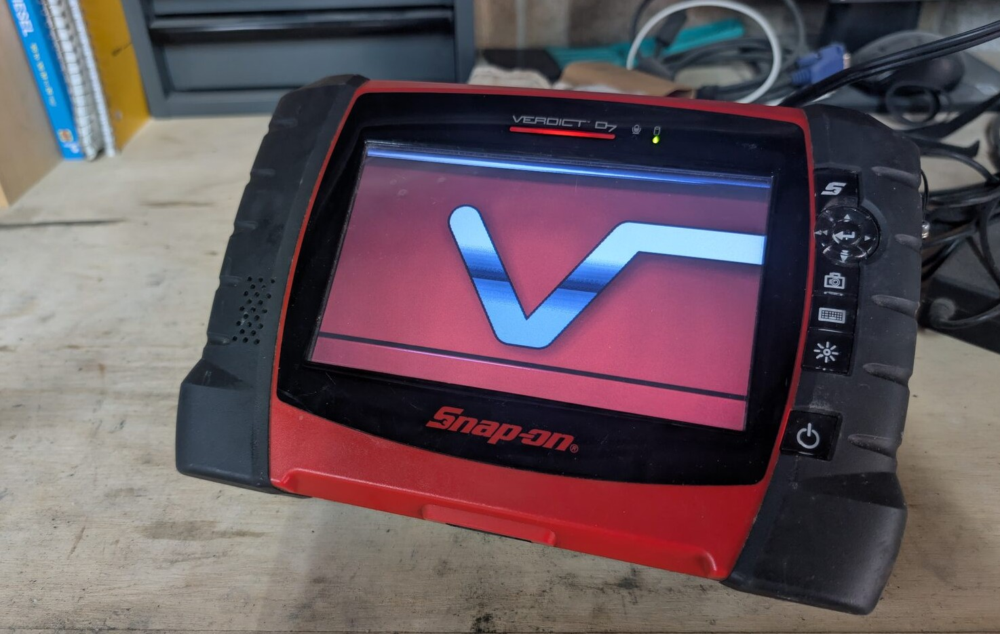
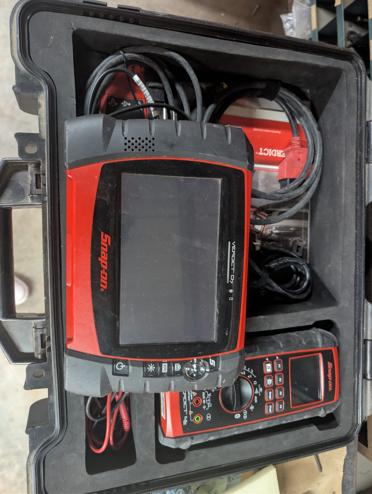
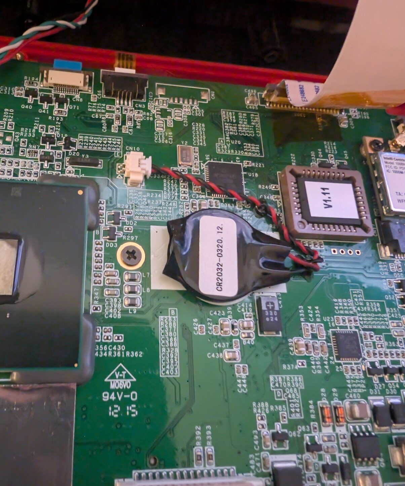
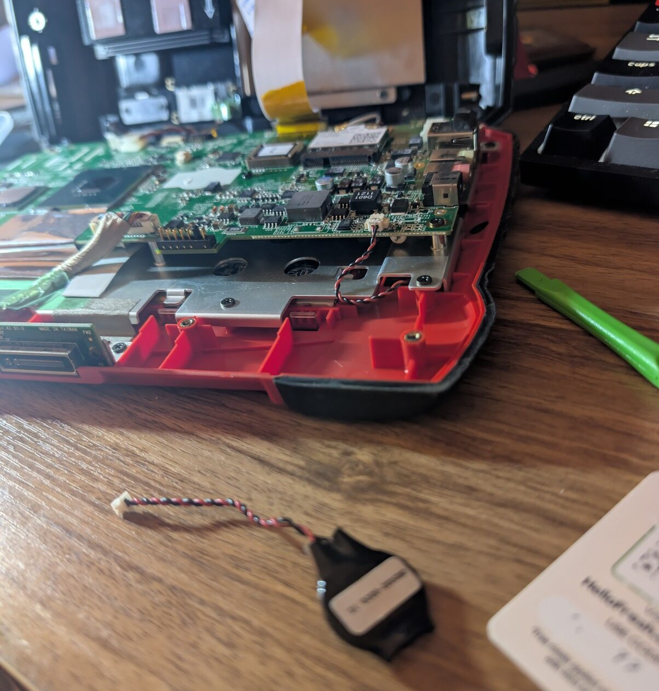

# 📝 Craftsman Field & Bench Notes
---

[Back to Portfolio Homepage](../index.md)

---

### Overview
A collection of sub-projects ranging from refurbishing daily driver headphones, reviving a legacy PowerPC iBook on-site and bringing a $6,000 diagnostic scanner back online.

These projects aren't just busy work, they're further exploration of both the obscure and everyday tech that surrounds us, proving that simple maintenance and practical problem solving can extend a system's lifespan and keep valuable hardware from ending up in landfills.

---

 

## -Snap-on Verdict CMOS Swap

---
### Project Description
Resolving a system lockout on a Snap-on automotive diagnostic scanner caused by a depleted CMOS battery.

---
### Details

* **Device:** Snap-on Verdict D7 Diagnostic Scanner LCD Display (MN:EEHD300)
* **Primary Issue:** Boot stall / RTC Checksum Error & Suite Lockout
* **Key Solution:** Clock recovery via 2-pim Molex CR2023 swap
* **Tools & Cost:** Precision screwdriver set, $6.39 replacement battery

---
### Project Log

<b></b>2026-04-02 Snap-on CMOS
b>

A local shop owner entrusted me with a pretty unique and expensive piece of equipment. The Snap-on Verdict D7 display unit (MN:EEHD300). Brand new from Snap-on this is a $6,000 unit. The stakes felt high, a pretty big jump from fumbling around with my own broken tech.

### Customer Report_

The shop owner explained to me that out of nowhere when booting up the D7, the screen would stall at a wall of terminal like text and he needed a keyboard to plug into the device to hit F2 to skip it. The issue was, once the devices was booted to the desktop, Running Windows Embedded Standard (Essentially a stripped down windows 7), they were still unable to open the Snap-on Diagnostic suite (A program used as a dashboard to translate a cars computer into readable information). 

This led them to believe that Snap-on essentially remotely bricked the device via some licensing agreement, which is becoming a very painfully common ordeal. 

My heart rate spiked a bit, I was already thinking of the nightmare before me. Side stepping some nonsense licensing hook or having to translate the drive to another system entirely, but then how do I ensure the OBD cables can still work with whatever new system I Frankenstein together? I kept these theories to myself for the most part, but I think they were rightfully concerned.

### Hands-On Diagnosis_

Getting the D7 home and booting it up... I was hit with a huge reality check. The black screen appeared and my eyes locked onto the real culprit. "CMOS checksum error - Defaults loaded". The wave of relief I felt was beautiful.

The CMOS coin battery was dead, that's nothing compared to the system level war I was mentally preparing for. 

### Execution_

Opening up the D7 was straightforward, one by one finding screws around the edges of the back of the shell, two under the Li-ion battery. Boom, I was in, the CR2032 CMOS coin battery was right there atop the PCB. Connected only by a single 2 pin Molex and a adhesive pad under the coin, It put up a little fight coming out, but no deal.

Placed an order for a Rome Tech CR2032 CMOS battery for $6.39 before tax and shipping. When it arrived the following day, I plugged in the Molex, stuck the coin it down to the PCB, put the shell back together and booted her up. Once on the desktop, I altered the date and time and restarted the device. The date and time held true and the Snap-on diagnostic suite loaded up without a hitch.

### Conclude_

The shop owner was very happy and clearly a bit surprised. It really felt amazing to restore his device that otherwise may have been written off as some system level lockout. The simplest solution is often correct, but can lead to waste and abandonment if undiscovered.

  
  
    
      

---

 

## -Apple iBook G4 - Field Diagnostic & System Restoration

---
### Project Description
Restoring a 23-year-old PowerPC laptop on-site in an independent local auto shop by repairing the root filesystem.

---
### Details

* **Device:** Apple iBook G4 (12-inch PowerPC)
* **Primary Issue:** Startup boot & GUI stall
* **Key Solution:** Open Firmware disk ejection & Single-User Mode filesystem repair (fsck -fy)
* **Tools Used:** PowerPC Open Firmware, BSD root shell, legacy USB 2.0 thumb drive

---
### Project Log

<b></b>2026-06-08 G4 Restore
b>

The very same independent local shop owner of the Snap-on verdict D7 that I had repaired a few months ago, presented me with another unique problem. An Apple iBook G4, this has been his daily driver, storing personal photos, invoices and general data on clients and various projects he's worked on. 

I was ecstatic, loving that he had maintained and got so much use out of this legacy system for over two decades. Slightly out of my wheelhouse I'll admit, while I'm very familiar with macOS and iOS, it's been a while...

### Issues_

The shop owner was unable to boot the G4 up, It would spark to life, make the classic chime and then become stuck on the apple logo. This was a real problem, as there was loads of important data stored directly on this device, I reassured them that even if the G4 never starts up again, their data is most likely safe as I could always pull the HDD and recover it.

Now, the shop owner does have some old versions of adobe applications that they had purchased long ago, which is very neat, I used the adobe suit for many years and paid a hefty price for the subscription. Hearing they were still getting use out of those old versions from a disk, was awesome. The tricky part is getting those to work on a newer apple system, I have a few loose ideas for that that worst case arises, potentially Rosetta And maybe rigging up something custom within Linux, my coding skills aren't fantastic yet, but if push comes to shove, I'll figure it out. 

### Hands-On Diagnosis_

For this one, I had to stay within the walls of the shop. This was strange and new, up until now, all of the projects I've worked on have been at my own desk, this was a test. Eyes on me with only my phone for research, no walking away for a bit to ruminate, I had to lock in here. Sat down at his desk, I found he was right, the computer was stalling at the Apple startup logo. This iBooks battery is dead, it only gets power from the AC charger. I tried a few no brainers, unplugging the device and holding the power button down for 20 seconds. Doing a reset from the PRAM using Cmd + Alt + P + R. These did nothing.. Then I noticed something on the desk, an empty CD paper sleeve, I asked the shop owner about it and got a solid lead on a culprit. 

When the device wouldn't boot, they figured an update was in order and inserted a Mac OS X Snow Leopard Version 10.6 disk into the drive, which is intel only... the iBook runs on PowerPC architecture, so the G4's processor can't run that installer code and is most likely very confused and jumbled right now. It took a bit of research on my phone and scratching my head, but I came across a potentially route to a solution. 

This is where it gets neat if it wasn't already, The Apple iBook G4 has two different terminal based modes that can be accessed on startup. This system is vastly different than the new Apple silicon stuff and even the later stage intel Apple systems, while Apple's foundation remains Unix, this legacy laptop differs in a big way. 

* **Open Firmware** (Accessed via: Cmd + Alt + O + F) 
This one is really cool, it's essentially the BIOS for these systems. This one grants System level access which was exactly the place to be if one needed to eject a stuck disk... It's also a white terminal which I hadn't seen before, blinding, but super cool. I got the disk out, but now, I needed some deeper level access to get the G4 to boot, as it was still getting hung up.

* **Single-User Mode** (Accessed via: Holding Cmd + S upon boot)
This grants Admin level access to the mac OS itself. This one felt more familiar, a standard black terminal and the exact right place to be if one needed to repair corrupted files, which I was pretty sure was where the issues were lying. Using the fsck -fy (File System Consistency Check, Force, Yes) command I could have the computer hunt down any files that may be causing mischief. After a few minutes of scanning itself, it slowly printed out a list of areas it was checking, one after one they all read back as "ok" Then it finished stating an incorrect folder count within the catalog hierarchy. This was familiar, it's just the root directory hierarchy, this is where directories like your /dev (device files) and /etc (system configurations) lie. 

I ran the command again and the system spat back an overall "ok" so I powered down. Booted back and... BOOM back on the desktop. Truly, such a uniquely, satisfying moment. The shop owner was stoked of course and had me back up the delicate files on iBook and move them to their newer iMac 21.5-inch, Mid 2011 (wild name for a company such as Apple) just to keep them safe. That... took longer than anything else. The iBook wouldn't read the 60GB Samsung Bar on my key chain, so I made do with an old 16GB San-disk thumb drive the shop owner had, it took ~4 hours to move those 25GB off that iBook.  

### Conclude_

Very glad I was able to restore such a neat piece of history and even more so that people are stubborn and reject upgrades for certain tech they've gotten so familiar with. I was in diapers when the iBook G4 came out on the line and for the past 23 years, this system has been a hub for a local shop owner handling their day to day, here's to another 20. 

---

 

## -JBL Live 660NC Headphone Restoration

---
### Project Description
Clearing debris, repairing screw bosses and replacing components of a pair of JBL headphones.

---
### Details

* **Device:** JBL Live 660NC Wireless ANC Headphones
* **Primary Issue:** Rattling within internal shell, Cracked screw bosses, Degraded clamping force
* **Key Solution:** Debris clearing, Adhesive structural reinforcement, Replacement ear cups & Sleeve band addition 
* **Tools Used:** Spudgers / Prying tools & Precision screwdriver set, Electrical tape, Super glue

---
### Project Log

<b></b>2026-09-16: JBL Refurbish
b>

A small but much needed tune up of my JBL Live 660NC headphones. I had gotten these back in 2021 for ~$200 and they have been a very trusty companion ever since. Originally had gotten them for running and they worked well, stayed snug. They've aged a bit now and don't quite hug as tight as they used to... even so they've always remained my go to, I've listened to countless songs and made many tracks with these over ear. They aren't the most "True" sounding for music production so they've retired to just being for listening to music while I work at the desk... A desk they have fallen off of many times.

### Issues_

Since they have taken some hard falls over the years, I've started to hear some rattling within the ear cups, I'd like to open them up and clean out the fragments as eventually they'll damage whatever PCB lies beneath. The ear pads themselves are very worn down and could use replacing. I already ordered new ear pads along with a headband cushion cover, both in black. The JBL headphones are white and show wear and dirt easily, the new black ear pads will look fresh and stay that way longer. The headband sleeve should hide some of the dirtiness and wear along the fabric of the headband.

### Scouring_

Opening up the headphones was a tad tricky, screws are hidden well. There are silver plastic rings on either ear cup that can pop off to reveal 3 screws needed to separate the shell. These were not easy to get off... I had to poke around a bit and use tape to give me a handle of sorts to pull up and create a gap to pry them off. Once inside I removed any plastic bits that were floating around along with any bits that appeared to break off soon. Unfortunately a few of the screw bosses had broken apart. I did the best I could with some light super glue and functional screws to seal the ear cups back up.

Once the internals were cleaned up, I popped the old ear pads off and the new ones on, slid the sleeve over the headband and put them on. They don't fit as snug as they used to, but it's much better, they don't slide and the noise canceling works noticeably better now that the ear pads have some rigidity back.

### Conclude_

Pretty straightforward and simple stuff but much needed nonetheless. The super glue I'm sure may be drastic but I have a desire in the back of my head to eventually extract the components of the JBL headphones and place them in a new body. My mind immediately goes to wooden headphones... though that's most likely super impractical. I'll have to think more about what I want to do with that, but 100% something I'm interested in attempting later down the line. For now, a quick tune up was much needed and a relaxing low stakes little something to stay busy on the side.

---
